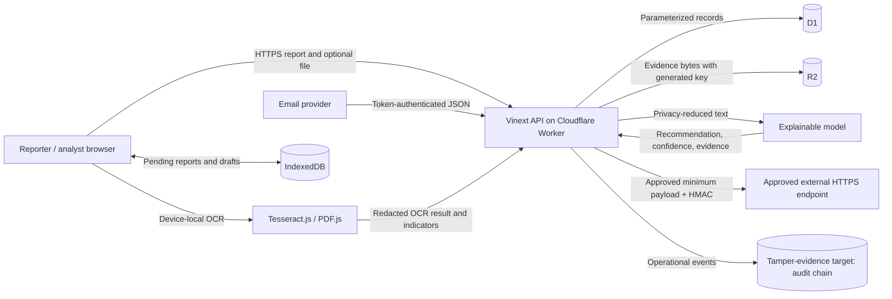

# Triage247Ng data-flow diagram

## Primary flow

## Sensitive flows

| Flow | Sensitive data | Required controls | Baseline gap |
| --- | --- | --- | --- |
| Browser to incident API | original report, reporter email, indicators | TLS, identity, validation, minimization | deployment TLS and rate controls are platform-dependent |
| Browser to attachment API | evidence bytes and filename | size/type/magic checks, quarantine, authorization | magic-byte and malware-state controls absent |
| API to D1 | reports, roles, audit, routing | parameterized queries, least privilege, retention, backup | retention/restore procedures absent |
| API to R2 | original evidence | generated key, hash, encryption documentation, access logging | hash/download/deletion controls incomplete |
| Browser to IndexedDB | offline reports/evidence, drafts | device trust, local expiration, user warning | no scheduled client retention enforcement |
| API to external webhook | privacy-reduced incident payload | human approval, HMAC, replay defense, safe endpoint, timeout | DNS rebinding and dead-letter controls incomplete |
| Email provider to API | sender and original message | constant-time token check, replay/rate limits, audit | timestamp/replay and rate controls absent |

## Data minimization

Only data necessary for triage and approved routing should cross each boundary. Original evidence and unredacted narratives remain inside the application boundary unless a separately approved legal/operational process authorizes disclosure. API responses must be role- and resource-filtered; external payloads must use privacy-reduced text.

