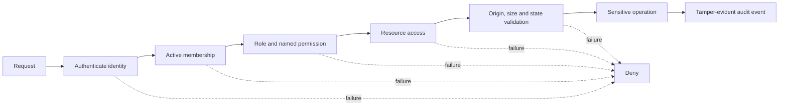

# Security architecture

## Principles

- Deny by default and authorize on the server with `db/security.ts`.
- Treat identity, role, permission and resource access as separate checks.
- Keep original evidence in R2 and relational metadata in D1.
- Return privacy-reduced text by default and audit original access.
- Treat OCR/model output as untrusted advice; humans approve correction, routing and closure.
- Use forward migrations; never edit previously applied migrations.
- Apply bounded parsing, generated object keys, hashes, quarantine state and no-sniff responses.
- Use a hash-linked audit chain; call it tamper-evident, not immutable.

## Request decision flow

## Deployment controls

Production must enforce HTTPS, a private Sites access policy, identity assurance/MFA appropriate to institutional risk, session expiration/revocation, WAF/rate limits, D1/R2 backup and recovery, encrypted secret storage, approved provider egress, monitoring and independent testing. These are not proven by local source code.

